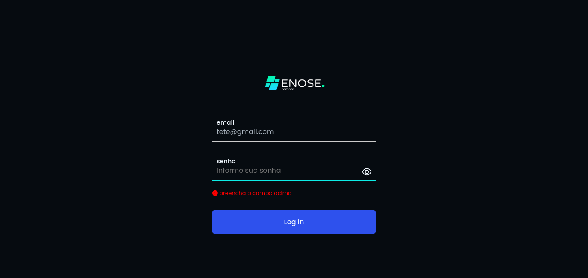
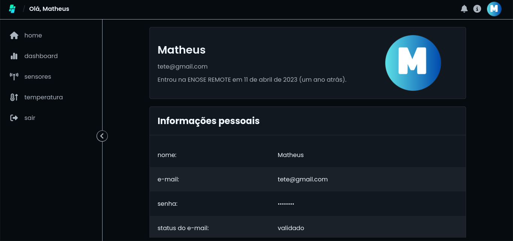
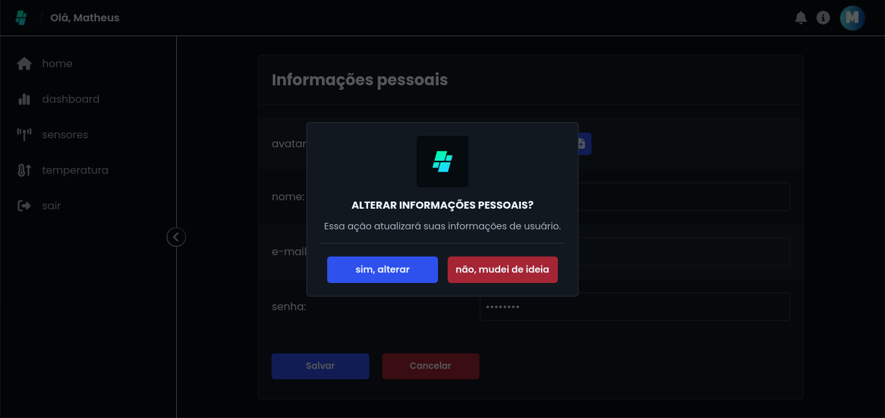

# O que é o enose-remote?

O enose-remote é uma projeto acadêmico de conclusão de curso (T.C.C), que consiste em um sistema web de monitoramento remoto de gases e afins.

> 🚧 Projeto em construção 🚧

## Screenshots

## ✅ Tecnologias, técnicas e arquitetura

### tecnologias:

- `HTML`
- `CSS`
- `JavaScript`
- `php`
- `composer`
- `mariadb`
- `twig`

### técnicas:

- `Programação Orientada a Objetos`

### arquitetrura

- `MVC`
